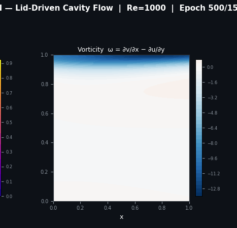

# PINN for 2D Lid-Driven Cavity Flow

Physics-Informed Neural Network (PINN) implementation for solving the incompressible 2D Navier–Stokes equations for the classical lid-driven cavity benchmark problem at Reynolds number `Re = 1000`.

This project demonstrates how deep neural networks can learn fluid flow behaviour directly from governing physical equations without relying on traditional CFD discretization methods.

---

# Overview

The lid-driven cavity problem is a classical benchmark in computational fluid dynamics (CFD).

A square cavity is filled with incompressible fluid where:

* The top wall moves horizontally with constant velocity
* All remaining walls remain stationary
* The moving lid generates vortices and recirculating flow structures inside the cavity

The PINN model learns:

* Horizontal velocity field `u(x,y)`
* Vertical velocity field `v(x,y)`
* Pressure field `p(x,y)`

by minimizing the residuals of the Navier–Stokes equations together with boundary condition constraints.

---

# Governing Equations

## Continuity Equation

```math
\frac{\partial u}{\partial x} + \frac{\partial v}{\partial y} = 0
```

## Momentum Equations

```math
u\frac{\partial u}{\partial x}
+
v\frac{\partial u}{\partial y}
=
-\frac{\partial p}{\partial x}
+
\frac{1}{Re}
\left(
\frac{\partial^2 u}{\partial x^2}
+
\frac{\partial^2 u}{\partial y^2}
\right)
```

```math
u\frac{\partial v}{\partial x}
+
v\frac{\partial v}{\partial y}
=
-\frac{\partial p}{\partial y}
+
\frac{1}{Re}
\left(
\frac{\partial^2 v}{\partial x^2}
+
\frac{\partial^2 v}{\partial y^2}
\right)
```

---

# Boundary Conditions

| Boundary    | Condition        |
| ----------- | ---------------- |
| Top Wall    | `u = 1`, `v = 0` |
| Bottom Wall | `u = 0`, `v = 0` |
| Left Wall   | `u = 0`, `v = 0` |
| Right Wall  | `u = 0`, `v = 0` |

---

# Technical Stack

* Python
* PyTorch
* Physics-Informed Neural Networks (PINNs)
* Automatic Differentiation
* NumPy
* Matplotlib

---

# Training Configuration

| Parameter       | Value                                           |
| --------------- | ----------------------------------------------- |
| Reynolds Number | 1000                                            |
| Epochs          | 15,000                                          |
| Optimizer       | Adam                                            |
| Outputs         | `u(x,y), v(x,y), p(x,y)`                        |
| Loss Components | PDE Residual + Boundary Conditions + Continuity |

---

# Results and Analysis

## Final Predicted Flow Fields

The final prediction below shows:

* Velocity magnitude with streamlines
* Horizontal velocity distribution
* Vertical velocity distribution
* Pressure field distribution

The model captures the dominant cavity vortex and produces physically consistent flow behaviour.

<p align="center">
  
</p>

### Observations

* Strong velocity gradients appear near the moving lid
* Streamlines indicate stable recirculating vortex formation
* Pressure increases near the upper-right corner due to lid motion
* No-slip wall conditions are clearly reflected in the velocity field

---

## Centerline Velocity Validation

The horizontal velocity profile at the cavity centerline (`x = 0.5`) is compared against the benchmark solution from Ghia et al. (1982).

<p align="center">
  
</p>

### Validation Summary

* The PINN prediction follows the benchmark trend successfully
* Near-wall behaviour is captured reasonably well
* Minor deviations exist near lower cavity regions
* The overall flow structure matches expected CFD characteristics

---

## Training Evolution

The following animation shows how the predicted fields evolve during training as the network gradually satisfies the governing equations and boundary conditions.

<p align="center">
  
</p>

### Observations

* Early-stage predictions contain incomplete flow structures
* The primary vortex stabilizes progressively during optimization
* Pressure and velocity fields become smoother over time
* PDE residual minimization improves physical consistency

---

## Vorticity Field Evolution

The vorticity field illustrates rotational behaviour inside the cavity throughout training.

<p align="center">
  
</p>

### Observations

* High vorticity regions form near the moving lid
* Rotational structures propagate throughout the cavity interior
* Boundary shear effects become increasingly pronounced
* The flow gradually approaches a stable steady-state solution

---

# Project Structure

```bash id="1m2c9d"
├── media
│   ├── pinn final fields.png
│   ├── pin Centerline validation(1).png
│   ├── Pinn Training.gif
│   └── vorticity.gif
│
├── PINN_Turbulence_2D.ipynb
└── README.md
```

---

# Key Features

* Mesh-free fluid flow learning
* Direct physics-constrained optimization
* Automatic differentiation for PDE residuals
* Simultaneous pressure and velocity prediction
* Benchmark validation against CFD literature
* Streamline and vorticity visualization support

---

# Current Limitations

* Training convergence remains computationally expensive
* Higher Reynolds numbers are harder to stabilize
* Sharp gradients can affect prediction accuracy
* Model performance depends on collocation sampling quality

---

# Future Improvements

* Adaptive collocation sampling
* Residual-based refinement strategies
* Multi-scale PINN architectures
* GPU-parallelized training
* Time-dependent Navier–Stokes extension
* Turbulence modelling integration

---

# Reference

**Ghia, U., Ghia, K. N., & Shin, C. T. (1982)**
*High-Re solutions for incompressible flow using the Navier–Stokes equations and a multigrid method.*
Journal of Computational Physics, 48(3), 387–411.
